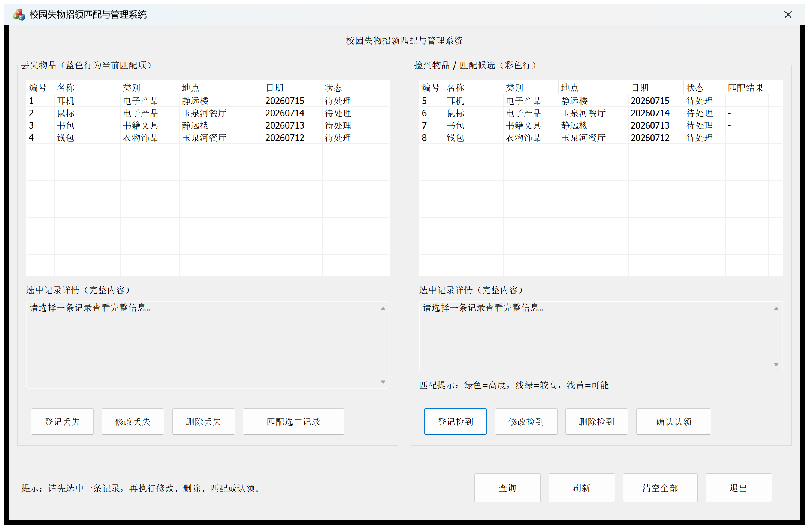
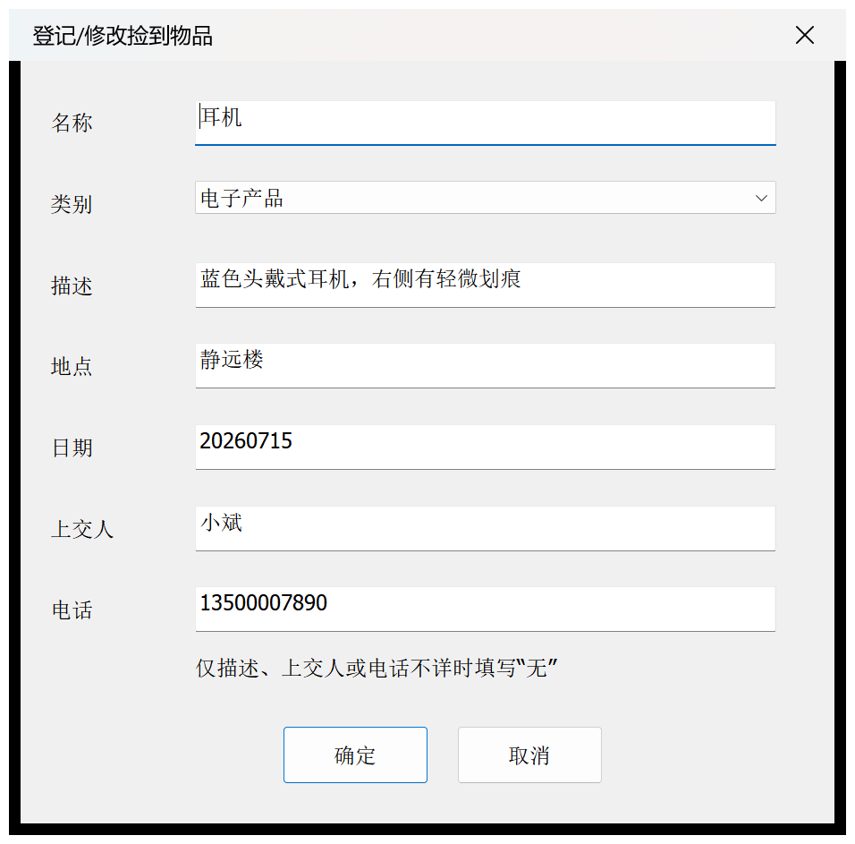
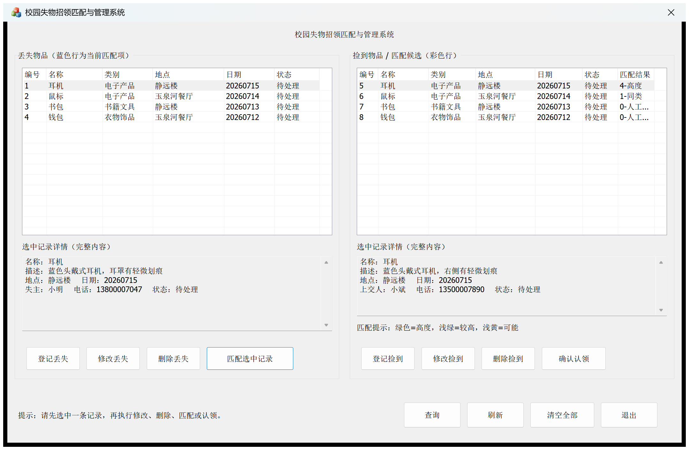
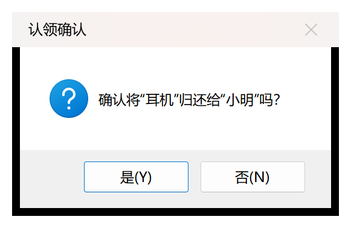
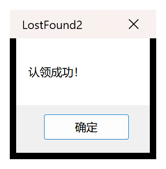
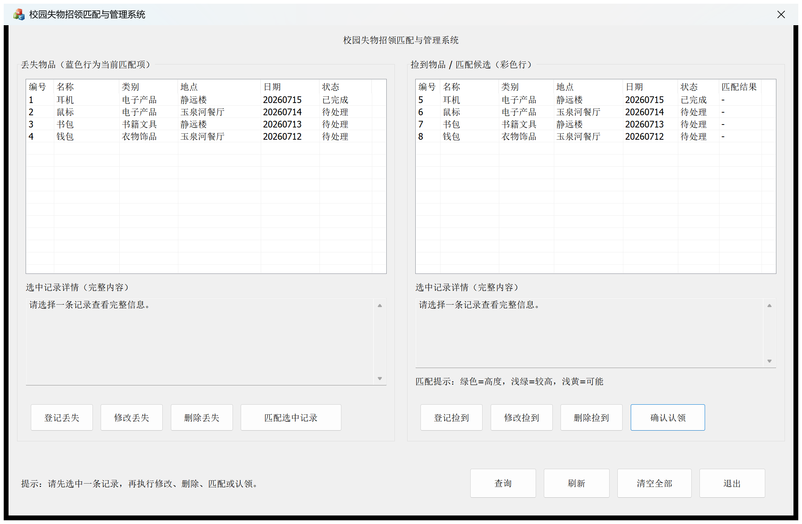
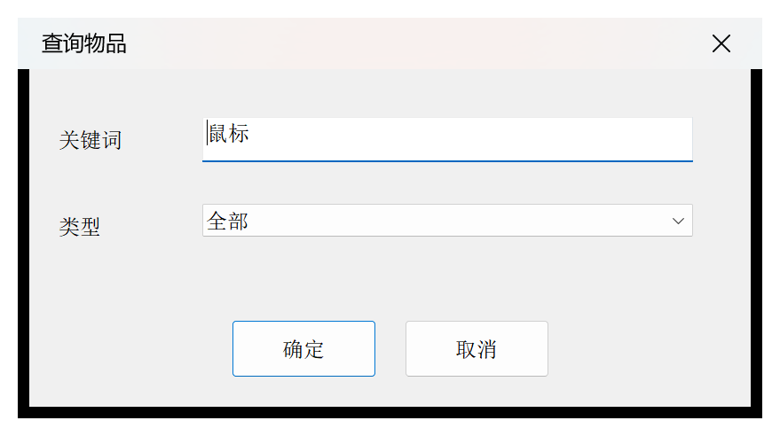
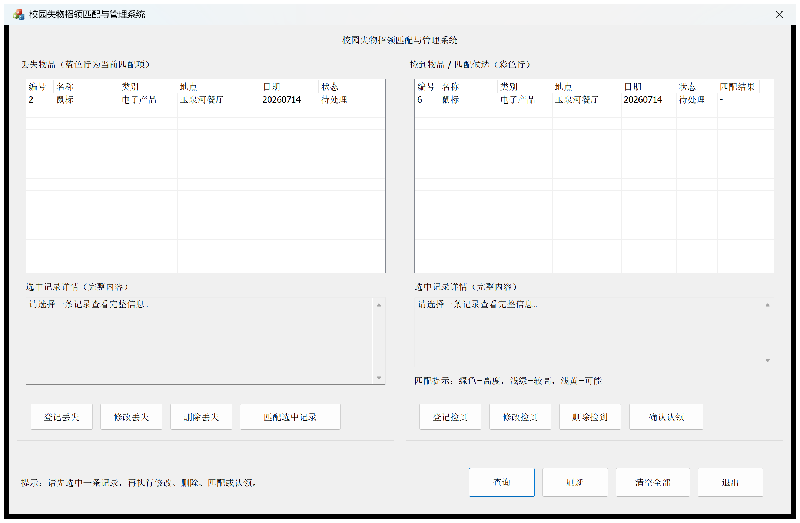

# 校园失物招领匹配与管理系统（MFC 版）

> 基于 MFC 对话框框架的 Windows 图形界面失物招领管理系统，提供丢失/捡到物品的登记、查询、修改、删除、匹配推荐与认领处理，使用 CFile 实现数据持久化。

[](https://isocpp.org/)
[](https://docs.microsoft.com/cpp/mfc/)
[](https://www.microsoft.com/windows)
[](https://visualstudio.microsoft.com/)
[](LICENSE)

---

## 界面预览



---

## 目录

- [1. 项目简介](#1-项目简介)
- [2. 功能特性](#2-功能特性)
- [3. 匹配推荐规则](#3-匹配推荐规则)
- [4. 技术栈](#4-技术栈)
- [5. 界面布局](#5-界面布局)
- [6. 项目结构](#6-项目结构)
- [7. 编译与运行](#7-编译与运行)
- [8. 使用说明](#8-使用说明)
- [9. 数据持久化](#9-数据持久化)
- [10. 测试用例](#10-测试用例)
- [11. 许可证](#11-许可证)

---

## 1. 项目简介

本项目是校园失物招领匹配与管理系统（MFC 版），以 Windows 图形界面提供服务。界面采用左侧丢失物品列表、右侧捡到物品列表的布局，并配有详细信息视图。工作人员通过按钮即可完成登记、修改、删除、匹配与认领等操作，交互直观。

本版本与同选题的控制台版业务逻辑一致，但采用 MFC 对话框 + CListCtrl + CFile 的图形化技术路线，体现了从控制台到 GUI 的能力提升。

## 2. 功能特性

- **登记丢失物品**：通过子对话框录入名称、类别、特征、地点、日期、失主信息
- **登记捡到物品**：录入上交物品信息，上交人信息可选
- **列表与详情**：两个 CListCtrl 分区展示丢失/捡到物品，选中行显示完整详情
- **修改记录**：选中记录后预填到子对话框，修改并保存
- **删除记录**：删除选中记录并刷新列表
- **匹配推荐**：为选中的丢失物品推荐候选捡到物品并按分数排序、高亮展示
- **确认认领**：人工确认后完成认领，同步更新双方状态
- **查询物品**：按名称/地点关键词 + 类型过滤查询
- **清空与刷新**：一键清空全部记录或恢复完整列表
- **数据持久化**：使用 CFile 自定义序列化，重新打开程序数据完好

## 3. 匹配推荐规则

对选中的丢失物品，程序扫描全部"待处理"的捡到物品，按以下规则计算匹配分：

| 匹配条件 | 加分 |
|---|---|
| 类别相同 | 1 分 |
| 名称相同或互相包含 | +1 分 |
| 地点相同或互相包含 | +1 分 |
| 日期完全相同 | +1 分 |

总分范围为 **0 ~ 4 分**，候选按分数从高到低排序，匹配分显示在列表"匹配分"列。匹配分只用于排序与推荐，不强制作为认领条件：

| 分数 | 含义 |
|---|---|
| 4 分 | 高度推荐 |
| 3 分 | 较高推荐 |
| 2 分 | 可能匹配 |
| 0 ~ 1 分 | 同类别但信息较少，需人工核对 |

## 4. 技术栈

- **框架**：MFC（Microsoft Foundation Class），基于对话框应用，Unicode 字符集
- **语言**：C++
- **开发环境**：Visual Studio 2019（MSVC v142 + MFC 库）
- **平台**：Windows
- **界面控件**：CListCtrl（报表视图）、CComboBox、CEdit、按钮
- **数据存储**：`CString` + `CFile` 自定义二进制序列化
- **数据绑定**：DDX/DDV 对话框数据交换

## 5. 界面布局

```
┌──────────────────────────────────────────────────────────┐
│ 校园失物招领匹配与管理系统                                  │
├──────────────────────────────────────────────────────────┤
│ 丢失物品列表            │  捡到物品列表（含匹配分列）        │
│ ┌────────────────────┐ │  ┌────────────────────┐         │
│ │编号 名称 类别 ...   │ │  │编号 名称 类别 ... │           │
│ └────────────────────┘ │  └────────────────────┘         │
│ [登记丢失][修改][删除]   │  [登记捡到][修改][删除]           │
│ [匹配选中丢失物品]       │  [确认认领]                     │
│ ┌────────────────────┐ │  ┌────────────────────┐         │
│ │丢失记录详情         │ │  │捡到记录详情         │          │
│ └────────────────────┘ │  └────────────────────┘         │
│ [查询] [清空全部] [刷新] [退出]                            │
└──────────────────────────────────────────────────────────┘
```

## 6. 项目结构

```
LostFound_GUI/
├── LostFound2.cpp / .h      应用程序入口
├── LostFound2Dlg.cpp / .h   主对话框（列表、按钮、匹配认领逻辑）
├── LostFoundBook.cpp / .h   数据管理类（CRUD、匹配、认领、文件读写）
├── Item.h                   物品记录结构体定义
├── CLostItemDlg.cpp / .h    丢失物品信息对话框（增加/修改复用）
├── CFoundItemDlg.cpp / .h   捡到物品信息对话框（增加/修改复用）
├── CQueryDlg.cpp / .h       查询条件对话框
├── resource.h               资源标识定义
├── LostFound2.rc            资源文件
├── pch.cpp / pch.h          预编译头
├── framework.h              框架头文件
├── targetver.h              平台版本定义
├── res/                     图标等资源
├── LostFound2.sln           Visual Studio 解决方案
├── LostFound2.vcxproj       Visual Studio 项目文件
├── screenshots/             运行截图
├── .gitignore
├── LICENSE
└── README.md
```

## 7. 编译与运行

**环境要求：**
- Windows
- Visual Studio 2019（含 **C++ 桌面开发** 与 **MFC 库** 组件）

**编译运行：**
1. 使用 Visual Studio 2019 打开 `LostFound2.sln`
2. 选择 `Debug` 配置与 `x64` 平台
3. 按 `Ctrl+Shift+B` 生成解决方案
4. 按 `Ctrl+F5` 运行程序

> 注意：若未安装 MFC 组件，请在 Visual Studio Installer 中勾选"适用于 v142 生成工具的 C++ MFC (x86 和 x64)"后重新生成。

## 8. 使用说明

### 登记物品

点击"登记丢失"或"登记捡到"按钮，在子对话框中填写信息。




### 列表与详情

左右两侧列表分区显示丢失/捡到物品，选中任意一行，下方详情框显示该记录的完整信息。


### 匹配推荐

选中一条丢失物品，点击"匹配选中丢失物品"，右侧列表切换为候选捡到记录并按分数排序、高亮显示；"匹配分"列展示推荐分数。



### 确认认领

选中候选记录后点击"确认认领"，弹出确认框核对双方信息。确认后同步完成丢失/捡到记录的认领。




认领完成后，对应记录状态更新为"已完成"。



### 查询

点击"查询"打开查询对话框，输入关键词并选择类型（全部/丢失/捡到）。



查询结果按类型分别插入左右列表。



### 清空与刷新

- **清空全部**：清空内存与文件中的全部记录
- **刷新**：恢复显示完整物品列表

## 9. 数据持久化

程序使用 `CFile` 将记录写入 `lostfound_gui.dat` 文件，采用自定义序列化格式：

- 文件开头写入记录数量 `cnt`
- 每条记录按固定顺序写入：`type` / `category` / `status` / 各 `CString`（先写字符数，再写内容字节）
- 保存与读取顺序完全一致
- 读取前校验 `cnt` 在合法范围，字符串缓冲区读取前清零，避免越界与文件损坏
- 数据文件已被加入 `.gitignore`，不会提交到仓库

## 10. 测试用例

**CRUD 测试：**

- 分别登记丢失与捡到物品，验证列表刷新
- 修改两类物品并验证详情更新
- 删除两类物品并验证列表刷新
- 按名称与地点关键词、类型组合查询
- 刷新恢复完整列表
- 未选中记录时点击操作按钮的提示
- 添加到 100 条后验证无法继续添加
- 关闭并重新打开程序，验证数据持久化

**匹配与认领测试：**

- 选中丢失记录执行匹配，验证候选按分数排序与高亮
- 从候选列表确认认领，验证双方状态更新为"已完成"
- 已完成记录不再参与匹配
- 同一条捡到记录不能被重复认领
- 修改、删除记录后旧匹配结果不可继续使用

**边界测试：**

- 空列表时各种操作
- 非法日期格式、必填项为空时的校验提示
- 清空后列表与数据文件同步

## 11. 许可证

本项目基于 [MIT License](LICENSE) 开源。
